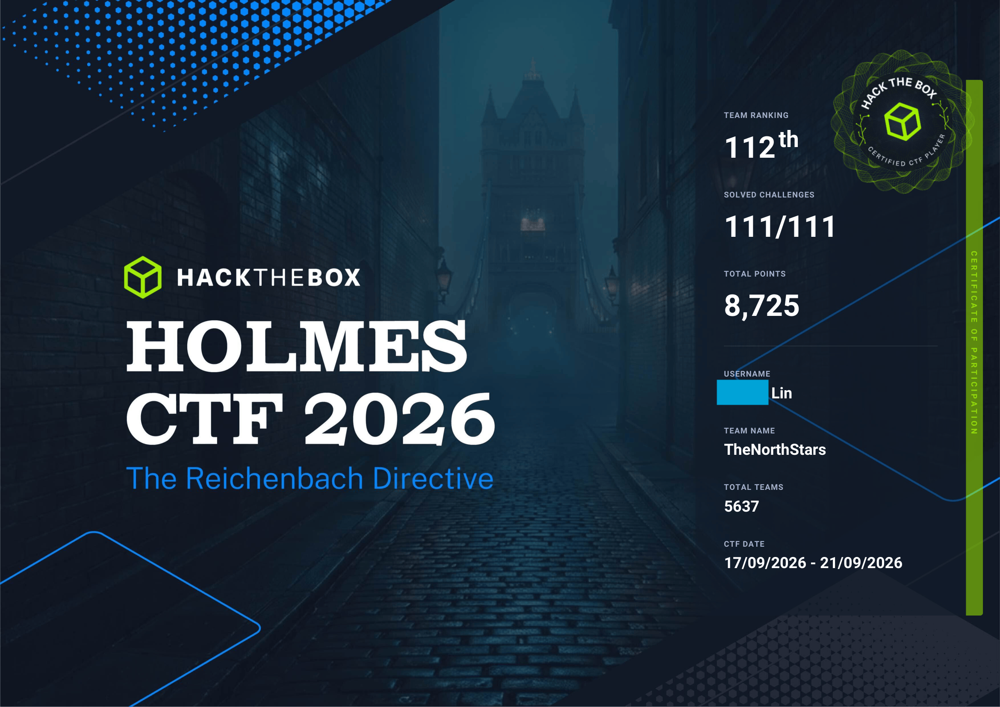

I just finished Holmes CTF 2026 with my team. It was really fun. We ended up ranking 112th out of 5,637 teams.
We solved all the challenges on Saturday morning, which was almost 24 hours before the CTF ended. 

This was actually the first time we had ever finished all the challenges in a CTF.
There was only one flag left at the end. One of my teammates was really close to it, but he had to leave home at that moment.
The three of us left were trying really hard to get it, because the sooner we finished, the higher our ranking would be.
I found the flag within a few minutes, but right before I could submit it, it told me that the scenario had already been pwned by one of my teammates.
I was really happy to see us working together like this. Before I created this team during the summer, I always had to solve all the challenges by myself. Now, everyone on the team is trying their best, and it's great to see that we are all working toward the same goal.

I think I did pretty well on this one too. I found 43 flags out of 111 for our team. Most of the challenges I worked on were related to forensics, malware analysis or investigations. These are areas I've been trying to learn more about recently, so it was nice to actually apply some of that knowledge in a competition.

Our team write-ups is at https://github.com/TheNorthStars-CTF/Holmes-CTF-2026-Write-ups

